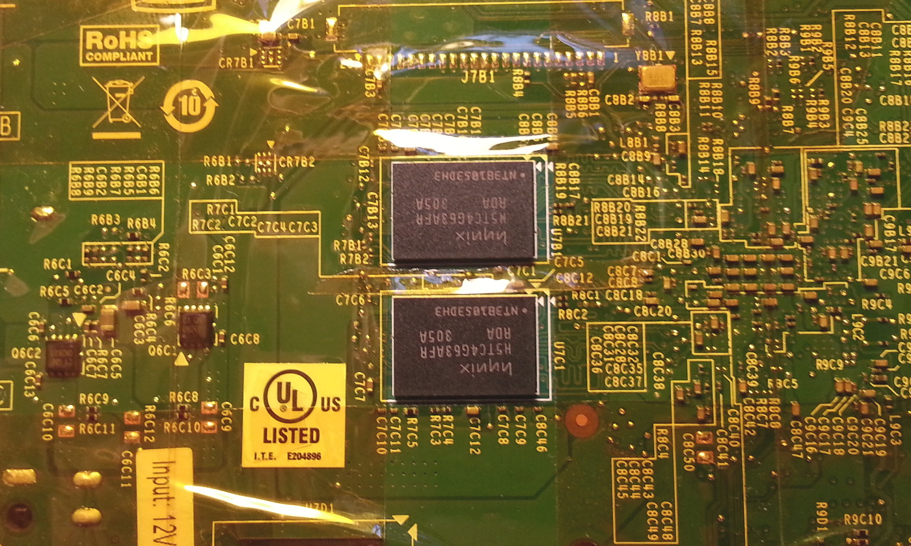
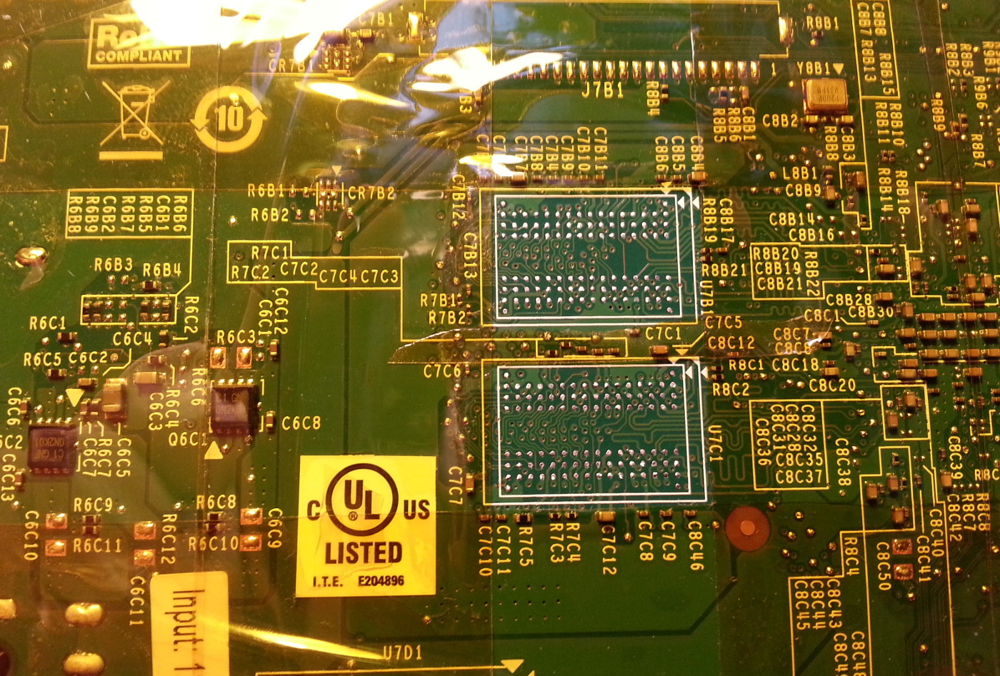
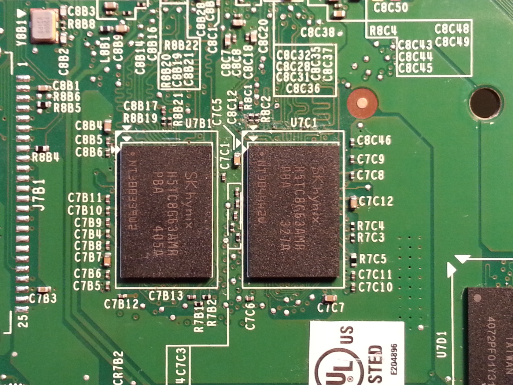

Jetson TK1 4GB DRAM upgrade
===========================

Hardware
--------

Jetson TK1 ships with four [H5TC4G63AFR-RDA](https://www.skhynix.com/products/computing/view.jsp?info.ramKind=19&info.serialNo=H5TC4G63AFR) 256Mb x 16 DDR3L ICs. These can be replaced with 512Mb x 16 DDR3L ICs for a total capacity of 4GB. The replacements I've used are [H5TC8G63AMR-PBA](https://www.skhynix.com/products/computing/view.jsp?info.ramKind=19&info.serialNo=H5TC8G63AMR).


**Requirements:**
* BGA rework capabilities - outside the scope of this document
* 8Gb replacement ICs - these are quite difficult to find, I got mine on Aliexpress (listing no longer available)
* replacement thermal paste because the heatsink must be removed while reworking the board
* a host computer with the [Jetson driver package](https://developer.nvidia.com/jetson-tk1-support) for setting up the Jetson board
* the [L4T kernel source](https://developer.nvidia.com/jetson-tk1-support)


I recommend replacing one IC at a time and testing that everything works correctly in between. This makes it possible to catch any soldering issues. A mix of H5TC4G63AFR and H5TC8G63AMR seems to work correctly with the default SDRAM configuration, but only 2 GB of memory are available.







Software configuration
----------------------

The default kernel configuration doesn't allow use of more than 2GB of RAM. The following options must be enabled:
* System Type > Full 4GB physical memory support
* System Type > Support for the Large Physical Address Extension

A patch is required to [limit the range of memory used for DMA buffers to the first 4GB of physical memory](patches/4gb_dma_zone.patch).

The default vmalloc size might need to be increased, either by passing a kernel argument (e.g. `vmalloc=300M`) or by applying another patch to [increase the default size](patches/vmalloc_size.patch).

The updated kernel image can be flashed by replacing `Linux_for_Tegra/kernel/zImage` and running:

```
sudo ./flash.sh -k 6 jetson-tk1 mmcblk0p1
```

Finally, access to the full 4GB of RAM is enabled by writing a new BCT file with the updated SDRAM configuration:

```
sudo nvflash --bct PM375_Hynix_4GB_H5TC8G63AMR_PBA_792MHz.cfg --updatebct SDRAM --bl ./fastboot.bin --go
```

This configuration was derived from the E1780_Hynix_4GB_H5TC8G63AMR_PBA_792Mhz.cfg and PM375_Hynix_2GB_H5TC4G63AFR_RDA_792MHz.cfg files provided by NVIDIA. This configuration works for me, but it might not be stable on other units.

The bootloader should then automatically pass similar parameters to the kernel:

    mem=1862M@2048M mem=2048M@4096M ddr_die=2048M@2048M ddr_die=2048M@4096M
    
License
-------

This document is licensed under a [Creative Commons Attribution-ShareAlike 4.0 International License](http://creativecommons.org/licenses/by-sa/4.0/).
